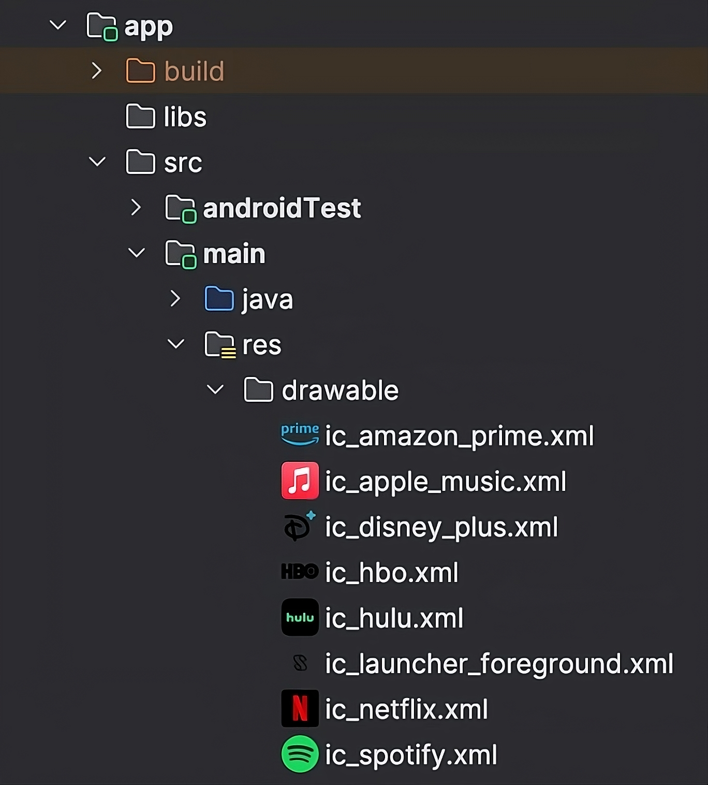

# Android Drawable Preview

An Android Studio / IntelliJ IDEA plugin that replaces the default file icons in the Project View with rendered previews of your drawables, and adds a richer right-click preview, editor gutter icons, tooltips, and a few related tools.

Works with both Android (`res/drawable*`, `res/mipmap*`) and Compose Multiplatform (`composeResources/drawable*`) projects.



---

## Features

**In the Project View**

- Inline thumbnail in place of the default file icon for every supported drawable: XML, SVG, PNG, JPG, WebP, GIF, 9-patch.
- Hover tooltip with a 96px preview, intrinsic dimensions, density bucket, and file size.
- Adaptive icons render through a launcher-style circular mask (configurable per popup: circle / squircle / rounded square / square).
- 9-patch (`.9.png`) markers are stripped so previews don't show black border lines.
- **Show Drawable Preview** right-click action opens a 256px popup with:
  - Light / Dark / Checkered / Transparent backgrounds
  - Adaptive-icon mask shape selector
  - Selector state tabs (one per `<item>` in a `<selector>`)
  - Density-variant comparison row (`mdpi → xxxhdpi`)
  - Dominant-color palette (click a chip to copy the hex)
  - **Copy as PNG** to the system clipboard

**In the editor**

- Gutter icons next to `R.drawable.foo` (Android) and `Res.drawable.foo` (Compose Multiplatform) references, showing the rendered drawable; click to open the file.

**Resource hygiene**

- **Find Drawable Usages** right-click action — opens IntelliJ's Find-in-Files preloaded with a regex matching every reference form (`R.drawable.foo`, `Res.drawable.foo`, `@drawable/foo`).
- **Unused drawable resource** inspection — flags drawables with no references anywhere in the project.

**Misc**

- Status-bar widget for a one-click master enable/disable toggle.
- Configurable preview size (16 – 256 px) in **Settings → Appearance → Android Drawable Preview**.
- Cached, off-EDT rendering — no UI stalls when scrolling through large resource folders.

---

## Compatibility

| Audience | Minimum |
| --- | --- |
| Android Studio | Panda (2025.3) |
| IntelliJ IDEA + Android plugin | 2025.3 (build 253) |
| JVM (matches IDE's bundled JBR) | 21 |

> **Older IDEs (Meerkat 2024.3 / Narwhal 2025.1 / Otter 2025.2):** stay on the 1.2.0 release. The Marketplace will route the right version automatically.

---

## Installation

### From the JetBrains Marketplace

1. **Settings → Plugins → Marketplace**
2. Search for *Android Drawable Preview*
3. Click **Install**

### From a release archive

1. Download the latest `drawable-preview-<version>.zip` from the [Releases page](https://github.com/Merkost/Android-drawable-preview-plugin/releases).
2. **Settings → Plugins → ⚙ → Install Plugin from Disk…**
3. Pick the downloaded zip.

---

## Configuration

**Settings → Appearance → Android Drawable Preview**

- *Show drawable previews in Project View* — master toggle, mirrored by the status-bar widget.
- *Preview size (px)* — clamped to `16..256`.

The adaptive-icon mask shape is remembered from the last selection in the preview popup.

---

## Building from source

```sh
git clone https://github.com/Merkost/Android-drawable-preview-plugin.git
cd Android-drawable-preview-plugin
./gradlew buildPlugin
```

The plugin zip lands at `build/distributions/drawable-preview-<version>.zip`.

For faster iteration against a locally-installed Android Studio, add the following to `local.properties` (gitignored, per-developer):

```properties
studio.dir=/Applications/Android Studio.app/Contents
```

Then `./gradlew runIde` launches a sandboxed IDE with the plugin loaded against your local install.

---

## Credits

Forked from [mistamek/drawable-preview](https://github.com/mistamek/drawable-preview). Maintained by [Merkost](https://github.com/Merkost).

## License

[Apache License 2.0](./LICENSE)
